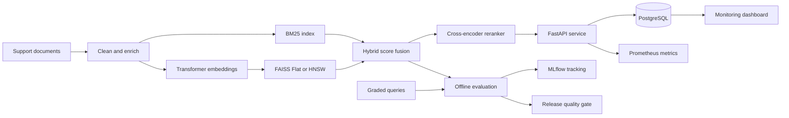

# Hybrid Retrieval and Ranking System


I built this project as an end-to-end technical-support search service. It retrieves relevant
knowledge-base articles with lexical and semantic search, combines the candidate sets, optionally reranks
them with a cross-encoder, and serves the results through an observable FastAPI application.

The project goes beyond a model demonstration. I designed the complete retrieval lifecycle: document
indexing, reproducible experiments, ranking evaluation, immutable artifacts, deployment, relevance feedback,
monitoring, release gates, and rollback.

> **Current benchmark scope:** The repository includes a small synthetic corpus and ten graded queries so the
> complete system can be reproduced quickly. The reported numbers validate the pipeline; they are not claims
> about performance on a production support corpus.

## Project highlights

| Engineering outcome | Implementation |
|---|---|
| End-to-end retrieval | BM25, dense search, hybrid fusion, metadata filters, and cross-encoder reranking |
| Measurable quality | Precision@K, Recall@K, MRR, nDCG, category slices, failure rate, and latency |
| Reproducible releases | Checksummed index bundles, source lineage, atomic promotion, rollback, and quality gates |
| Production serving | Async FastAPI, PostgreSQL, API authentication, health probes, and Prometheus metrics |
| Scalable deployment | Non-root Docker image, Kubernetes Deployment, HPA, Service, and disruption budget |
| Operational feedback | Query audit events, graded human feedback, dashboard, and failure analysis |
| Engineering quality | Pytest coverage threshold, Ruff, pre-commit, Dependabot, CI, and load testing |

**Current reproducible benchmark:** hybrid retrieval achieved `0.650 Recall@3`, `0.700 MRR`, and
`0.690 nDCG@3`; BM25 remained the current lightweight champion at `0.725 nDCG@3`. I retained this result
instead of presenting hybrid search as automatically superior—the experiment determines the champion.

## Table of contents

- [Problem statement](#problem-statement)
- [Solution overview](#solution-overview)
- [System architecture](#system-architecture)
- [Key capabilities](#key-capabilities)
- [Technology stack](#technology-stack)
- [Repository structure](#repository-structure)
- [Getting started](#getting-started)
- [Evaluation methodology](#evaluation-methodology)
- [Benchmark results](#benchmark-results)
- [Results interpretation](#results-interpretation)
- [API usage](#api-usage)
- [Production design](#production-design)
- [Kubernetes deployment](#kubernetes-deployment)
- [Monitoring and feedback](#monitoring-and-feedback)
- [Testing and CI](#testing-and-ci)
- [Limitations and next steps](#limitations-and-next-steps)

## Problem statement

Keyword search is effective when a query shares exact terms with a document, but it often misses paraphrases.
Dense retrieval handles semantic similarity, but it can underperform on product names, error codes, and rare
technical terms. A production search system also needs more than retrieval quality: it must meet latency goals,
track model and index versions, collect feedback, detect failures, and support safe deployment and rollback.

I addressed these requirements with a hybrid retrieval pipeline for technical-support knowledge search.

## Solution overview

For every query, the service performs the following workflow:

1. Validates the request and applies optional metadata filters.
2. Scores documents with BM25 lexical retrieval.
3. Scores documents with dense vector similarity.
4. Normalizes and combines both scores with a configurable fusion weight.
5. Optionally reranks the candidate set with a transformer cross-encoder.
6. Returns ranked documents with component-level scores and a unique query ID.
7. Records latency, result IDs, model metadata, artifact lineage, and failure status.
8. Accepts graded relevance feedback for subsequent evaluation and drift analysis.

## System architecture



The detailed design and lifecycle decisions are documented in
[docs/architecture.md](docs/architecture.md). Responsible-use guidance is available in
[MODEL_CARD.md](MODEL_CARD.md).

## Key capabilities

### Retrieval and ranking

- BM25 lexical baseline
- Dense semantic retrieval with configurable Sentence Transformers models
- Weighted hybrid score fusion
- FAISS Flat and HNSW index options
- Cross-encoder reranking over a bounded candidate set
- Category and product metadata filters
- Deterministic hashing embedder for fast, network-free tests

### Evaluation and experimentation

- Precision@K and Recall@K
- Mean Reciprocal Rank (MRR)
- Normalized Discounted Cumulative Gain (nDCG)
- P50 and P95 retrieval latency
- Failed-query rate
- Query-category performance slices
- BM25, dense, and hybrid ablations
- MLflow parameter and metric logging
- Automated release thresholds
- Claude-assisted failure-analysis summaries

### Serving and operations

- Asynchronous FastAPI request handling
- OpenAPI documentation
- Optional API-key authentication
- Prometheus counters and latency histograms
- Liveness and readiness probes
- Request correlation IDs
- PostgreSQL audit and relevance-feedback storage
- Privacy-preserving query hashing by default
- Streamlit monitoring dashboard
- Docker Compose deployment and Locust load tests

## Technology stack

| Area | Technologies |
|---|---|
| Machine learning | PyTorch, Transformers, Sentence Transformers |
| Retrieval | BM25, FAISS, HNSW, hybrid fusion, cross-encoder reranking |
| Evaluation | NumPy, graded relevance judgments, ranking metrics |
| Experiment tracking | MLflow |
| API | FastAPI, Pydantic, Uvicorn |
| Persistence | PostgreSQL, SQLAlchemy, SQLite for local development |
| Monitoring | Prometheus metrics, Streamlit, Plotly |
| Delivery | Docker, Docker Compose, Kubernetes, Kustomize, GitHub Actions |
| Testing and governance | Pytest, coverage gates, Ruff, pre-commit, Dependabot, Locust |

## Repository structure

```text
.
├── src/support_search/
│   ├── api.py               # HTTP endpoints, probes, authentication, metrics
│   ├── artifacts.py         # Immutable index creation and integrity validation
│   ├── config.py            # Environment-based validated configuration
│   ├── embeddings.py        # Hashing and transformer embedding backends
│   ├── evaluation.py        # Ranking and latency metrics
│   ├── failure_analysis.py  # Claude-assisted experiment analysis
│   ├── retrieval.py         # BM25, FAISS, hybrid fusion, reranking
│   ├── service.py           # Search orchestration and audit events
│   └── storage.py           # PostgreSQL and SQLite event storage
├── data/                    # Sample corpus and graded evaluation queries
├── dashboard/               # Operational monitoring application
├── loadtest/                # Locust workload
├── ops/kubernetes/          # Deployment, Service, HPA, and disruption budget
├── tests/                   # Unit, API, feedback, and artifact-integrity tests
├── docs/                    # Architecture documentation
├── .github/workflows/       # Continuous integration pipeline
├── Dockerfile
├── docker-compose.yml
├── MODEL_CARD.md
└── pyproject.toml
```

## Getting started

### Prerequisites

- Python 3.10 or newer
- Docker Desktop for the containerized production profile
- Optional: an Anthropic API key for generated failure-analysis summaries

### Local development

```bash
git clone https://github.com/rahul9908/hybrid-support-search.git
cd hybrid-support-search

python -m venv .venv
```

Activate the environment:

```powershell
# Windows PowerShell
.venv\Scripts\Activate.ps1
```

```bash
# macOS or Linux
source .venv/bin/activate
```

Install and validate the lightweight development profile:

```bash
pip install -e ".[dev]"
pytest -q
ruff check src tests loadtest dashboard
```

Build the index, run the benchmark, and enforce the release gate:

```bash
support-search build-index
support-search evaluate
support-search quality-gate
```

Start the API:

```bash
uvicorn support_search.api:app --reload
```

The interactive API documentation is available at `http://localhost:8000/docs`.

### Production ML profile

```bash
pip install -e ".[dev,ml,dashboard]"
```

```powershell
# Windows PowerShell
$env:SEARCH_EMBEDDING_MODEL = "sentence-transformers/all-MiniLM-L6-v2"
$env:SEARCH_RERANKER_MODEL = "cross-encoder/ms-marco-MiniLM-L-6-v2"
$env:SEARCH_INDEX_TYPE = "hnsw"
support-search build-index
```

For the complete containerized stack—including the API, PostgreSQL, and MLflow—run:

```bash
docker compose up --build
```

## Evaluation methodology

I evaluate each retrieval strategy against the same graded query set. This isolates the effect of the
retrieval method and avoids comparing systems on different data.

| Metric | What it measures | Why I use it |
|---|---|---|
| Precision@K | Relevant results among the first K results | Measures result-list cleanliness |
| Recall@K | Relevant documents recovered within K | Measures coverage |
| MRR | Rank of the first relevant result | Captures how quickly the user sees a useful answer |
| nDCG@K | Ranking quality with graded relevance | Rewards placing highly relevant documents first |
| P50/P95 latency | Typical and tail response time | Identifies user experience and capacity risk |
| Failed-query rate | Queries with no relevant result in K | Surfaces complete retrieval failures |

The default benchmark uses `K=3`. Timings cover in-process retrieval on the local sample corpus and do not
include network latency. Production evaluation should use a larger human-labeled query set, warm and cold
latency measurements, concurrency tests, and confidence intervals.

## Benchmark results

The current reproducible lightweight benchmark produced the following results:

| Retrieval strategy | Precision@3 | Recall@3 | MRR | nDCG@3 | P50 latency | P95 latency | Failed queries |
|---|---:|---:|---:|---:|---:|---:|---:|
| BM25 | 0.300 | 0.650 | **0.733** | **0.725** | 0.114 ms | 0.323 ms | **20%** |
| Dense | 0.300 | 0.550 | 0.550 | 0.513 | **0.114 ms** | **0.162 ms** | 40% |
| Hybrid | **0.333** | **0.650** | 0.700 | 0.690 | 0.125 ms | 0.164 ms | 30% |

Example evaluation output:

```json
{
  "hybrid": {
    "precision_at_k": 0.3333,
    "recall_at_k": 0.65,
    "mrr": 0.70,
    "ndcg_at_k": 0.6900,
    "p50_latency_ms": 0.1248,
    "p95_latency_ms": 0.1642,
    "failed_query_rate": 0.30,
    "query_count": 10
  }
}
```

The full machine-readable result is written to `artifacts/evaluation.json` whenever I run
`support-search evaluate`.

## Results interpretation

The experiment produced three useful findings:

1. **BM25 is the strongest ranking baseline on the sample data.** It achieved the highest MRR and nDCG and
   the lowest failed-query rate. The corpus contains distinctive technical terms such as *VPN*, *DNS*, and
   *password*, so exact lexical matches are particularly valuable.
2. **Dense retrieval alone is not competitive in the lightweight profile.** The reproducible test profile
   uses deterministic hashed token and bigram features instead of a pretrained semantic model. Its lower
   Recall@3 and 40% failure rate are expected and show why model choice must be evaluated rather than assumed.
3. **Hybrid retrieval improves Precision@3 but does not yet beat BM25 on ranking quality.** Fusion increased
   precision from 0.300 to 0.333 while preserving recall, but its MRR and nDCG remained slightly below BM25.
   I would therefore keep BM25 as the current lightweight benchmark champion and treat the hybrid system as
   a candidate for tuning with transformer embeddings, fusion-weight search, and cross-encoder reranking.

The category slices also reveal zero-MRR failures for software and messaging queries. These are more useful
than the aggregate score alone: they point to vocabulary mismatch and insufficient coverage in the tiny
corpus. My next experiment would expand labeled examples in those categories, run a real bi-encoder, tune
the hybrid weight, and measure whether reranking improves nDCG without violating the P95 latency objective.

## API usage

### Search

```bash
curl "http://localhost:8000/v1/search?q=vpn%20cannot%20resolve%20intranet&top_k=3&mode=hybrid"
```

Example response:

```json
{
  "query_id": "5e44b171-b864-4cd8-bf62-e491edc16fb7",
  "query": "vpn cannot resolve intranet",
  "mode": "hybrid",
  "reranked": false,
  "latency_ms": 0.31,
  "results": [
    {
      "id": "kb-004",
      "title": "VPN connects but internal sites do not load",
      "text": "Confirm DNS servers were assigned by the VPN...",
      "category": "network",
      "product": "vpn",
      "score": 1.0,
      "rank": 1,
      "scores": {"bm25": 5.24, "dense": 0.48}
    }
  ]
}
```

The top result is appropriate because the query describes a connected VPN that cannot resolve an internal
site, while `kb-004` specifically covers VPN-assigned DNS, split-tunnel routes, and internal-site access.
The component scores make the final hybrid decision inspectable.

Supported search parameters:

| Parameter | Values | Description |
|---|---|---|
| `q` | 2–500 characters | User query |
| `top_k` | 1–50 | Number of results |
| `mode` | `bm25`, `dense`, `hybrid` | Retrieval strategy |
| `rerank` | `true`, `false` | Apply the configured cross-encoder |
| `category` | String | Category metadata filter |
| `product` | String | Product metadata filter |

### Relevance feedback

```bash
curl -X POST "http://localhost:8000/v1/feedback" \
  -H "Content-Type: application/json" \
  -d '{"query_id":"<query-id>","document_id":"kb-004","relevance":3}'
```

I use a four-point relevance scale: `0` for irrelevant, `1` for marginally relevant, `2` for relevant, and
`3` for highly relevant. Feedback is linked to the original retrieval event through the query ID.

### Operational endpoints

| Endpoint | Purpose |
|---|---|
| `GET /health/live` | Confirms that the process is running |
| `GET /health/ready` | Confirms that the validated index is loaded |
| `GET /metrics` | Exposes Prometheus metrics |
| `GET /docs` | Provides interactive OpenAPI documentation |

## Production design

### Reproducible index lifecycle

`support-search build-index` creates an immutable serving bundle containing the documents, dense vectors,
and a manifest. The manifest records the source-data SHA-256 hash, embedding model, vector dimension,
document count, runtime version, creation time, and individual file checksums.

At production startup, the service verifies every checksum and confirms that the configured embedding model
matches the artifact. It refuses to become ready if validation fails. A new build is promoted atomically, and
the previous bundle is retained for rollback.

### Release process

My release workflow is:

1. Build an index from an immutable corpus snapshot.
2. Run BM25, dense, and hybrid evaluation against fixed relevance judgments.
3. Log parameters and metrics to MLflow.
4. Enforce minimum nDCG/MRR and maximum P95 latency/failure thresholds.
5. Build and scan the container image.
6. Deploy a candidate and wait for the readiness probe.
7. Shift traffic gradually and compare live operational metrics.
8. Promote the candidate or restore the prior image and index artifact.

### Configuration and security

Configuration is validated through environment variables. Copy `.env.example` to `.env` for local changes.
Important settings include:

| Variable | Purpose |
|---|---|
| `SEARCH_EMBEDDING_MODEL` | Embedding backend or Sentence Transformers model |
| `SEARCH_RERANKER_MODEL` | Optional cross-encoder model |
| `SEARCH_INDEX_TYPE` | `flat` or `hnsw` |
| `SEARCH_DATABASE_URL` | PostgreSQL connection string |
| `SEARCH_API_KEY` | Optional API credential |
| `SEARCH_RETAIN_QUERY_TEXT` | Explicit opt-in for raw query storage |

The container runs as a non-root user. Query text is hashed by default, and raw text is retained only when
explicitly enabled. In an actual deployment, I would place the service behind TLS, store credentials in a
managed secret store, enforce rate limits at the gateway, and apply organization-specific retention rules.

## Kubernetes deployment

The repository includes a Kustomize-ready deployment under `ops/kubernetes`. It defines two initial API
replicas, CPU-based autoscaling from 2 to 10 pods, rolling health checks, resource requests and limits,
Prometheus scrape annotations, a Pod Disruption Budget, a non-root identity, a read-only root filesystem,
seccomp, and dropped Linux capabilities.

Create the runtime secret without committing credentials:

```bash
kubectl create secret generic support-search-secrets \
  --from-literal=SEARCH_DATABASE_URL='postgresql+psycopg://<user>:<password>@<host>:5432/search' \
  --from-literal=SEARCH_API_KEY='<generated-secret>'
```

Set the published image in `ops/kubernetes/deployment.yaml`, then deploy:

```bash
kubectl apply -k ops/kubernetes
kubectl rollout status deployment/support-search
```

The checked-in manifest intentionally excludes database credentials, TLS certificates, and cloud-specific
ingress configuration. Those values belong in the target platform's secret manager and deployment overlay.

## Monitoring and feedback

The service exposes request counts, failed-query counts, and latency histograms through Prometheus. Search
events and relevance feedback are persisted to PostgreSQL in the containerized profile and SQLite WAL during
local development.

Start the dashboard with:

```bash
streamlit run dashboard/app.py
```

The dashboard tracks:

- Query volume
- P95 latency
- Failed-query rate
- Feedback coverage
- Latency and failure trends over time
- Human relevance-score distribution
- Recent failed query hashes

For offline error analysis, run:

```bash
support-search failure-report
```

Without an API key, the command writes a reproducible analysis prompt. With `ANTHROPIC_API_KEY` configured,
it generates a Claude-assisted summary of retrieval failures and recommends prioritized experiments. Raw
production queries should be redacted before any external analysis.

## Testing and CI

The automated tests cover ranking metrics, lexical retrieval, metadata filtering, invalid modes, API health,
search, relevance feedback, artifact round-tripping, and checksum tampering.

```bash
pytest -q
ruff check src tests loadtest dashboard
pytest --cov=support_search --cov-report=term-missing
```

GitHub Actions performs linting, tests, index construction, offline evaluation, release-gate validation, and
Docker image construction. A Locust workload is included for concurrency and tail-latency testing:

```bash
locust -f loadtest/locustfile.py --host http://localhost:8000
```

Before committing, I run the same formatting and repository checks locally through pre-commit:

```bash
pre-commit install
pre-commit run --all-files
```

Dependabot monitors Python, GitHub Actions, and Docker dependencies. Contribution expectations and security
reporting are documented in [CONTRIBUTING.md](CONTRIBUTING.md) and [SECURITY.md](SECURITY.md).

## Limitations and next steps

The repository demonstrates production engineering patterns, but the bundled dataset is intentionally small.
Before deploying the system for real users, I would:

- Replace the synthetic corpus with a licensed, versioned support dataset.
- Create at least 500 representative queries with independently reviewed graded judgments.
- Add document-level access control and tenant-aware filtering.
- Add PII and secret redaction before persistence or external analysis.
- Store index bundles in object storage and pin them by immutable version.
- Introduce managed PostgreSQL migrations and backup/restore tests.
- Run sustained load, failure-injection, and recovery tests in the target environment.
- Add confidence intervals, online interleaving or A/B tests, and alert thresholds based on real traffic.
- Package the champion pipeline as an MLflow model and manage `candidate` and `champion` registry aliases.

These steps separate a well-engineered, production-oriented repository from a fully operated production
service with real users, real relevance judgments, and organization-specific infrastructure controls.
