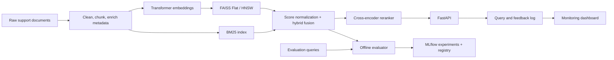

# Architecture

The default CI path uses a deterministic hashing embedder so tests need no network or model download. Set
`EMBEDDING_MODEL=sentence-transformers/all-MiniLM-L6-v2` for transformer embeddings. FAISS is selected
automatically when installed; `INDEX_TYPE=hnsw` configures an HNSW index.

## Lifecycle

Every evaluation run records parameters and aggregate metrics in MLflow. A release candidate consists of
the embedding model identifier, index configuration, source-data hash, evaluation artifact, and Docker
image digest. Promote a version by registering the packaged retrieval model and moving the `champion`
alias only after offline quality and latency gates pass.

Serving never silently rebuilds an index in production. Startup loads an immutable bundle, validates every
checksum and the embedding-model identity, then reports readiness. Query text is SHA-256 hashed by default;
explicit configuration is required to retain raw text. Relevance feedback is joined through opaque query IDs.

For a horizontally scaled deployment, configure the included `EventStore` with PostgreSQL, store versioned
index bundles in object storage, and download a pinned bundle in an init container. Use the same manifest
validation before readiness is enabled.
